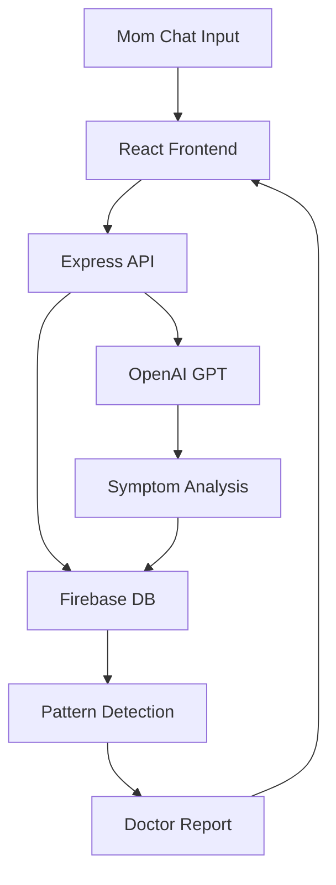

text
# MomCareAI

[](https://github.com/navikaloganathan-crypto)
[](LICENSE)

**MomCareAI** is an AI-powered health companion for mothers that tracks daily symptoms through chat, sends medicine/health reminders, detects simple health patterns, and generates doctor-friendly summary reports using simple, non-technical language.

Built for **INNOVATEX 4.0 – BuildWithAI 24 Hour International Innovation Hackathon** at Presidency University, Bengaluru.

## 📖 Overview

**Problem**: New mothers struggle to track symptoms, remember medications, and communicate health patterns to doctors effectively.

**Solution**: MomCareAI provides:
- Simple chat interface for symptom logging (text/voice-ready)
- Smart medicine and health reminders
- Pattern detection (fatigue trends, sleep issues)
- Doctor-ready summary reports
- Non-technical, empathetic language

## 🎯 Features

- ✅ Symptom tracking via chat
- ✅ Medicine & health reminders
- ✅ Basic health pattern detection
- ✅ Doctor-friendly summary reports
- ✅ Simple, mobile-friendly UI
- 🔄 Voice input (stretch goal)
- 📱 PWA-ready (works offline)

## 🛠️ Tech Stack

| Component | Technology | Why? |
|-----------|------------|------|
| Frontend | React + Tailwind | Fast UI, mobile-first |
| Backend | Node.js + Express | Simple API server |
| Database | Firebase Firestore | Free tier, real-time |
| AI | OpenAI GPT-4o-mini | Smart symptom analysis |
| Notifications | Firebase Cloud Messaging | Push notifications |

## ✨ Live Demo
[Hackathon Demo Video - Coming Soon]
[Deployed URL - Coming Soon]

text

## 📱 Screenshots
[Chat Screen] [Dashboard] [Report Screen]
⬇ ⬇ ⬇
[Screenshot] [Screenshot] [Screenshot]

text

## 🚀 Quick Start

```bash
# Clone the repo
git clone https://github.com/navikaloganathan-crypto/momcareai.git
cd momcareai

# Install dependencies
npm install

# Start development
npm run dev
```

**Live at**: `http://localhost:3000`

## 🗺️ Project Architecture



**Data Flow**: Mom → "I have headache + fatigue" → AI analyzes → Stores symptoms → Detects patterns → Generates report

## 📋 Implementation Phases

### Phase 1: MVP (4-6 hrs)
- ✅ Basic chat UI
- ✅ Store messages in Firebase
- ✅ Simple symptom logging

### Phase 2: Core (8-10 hrs)
- ✅ Medicine reminders
- ✅ Symptom history dashboard
- ✅ Basic notifications

### Phase 3: Polish (6-8 hrs)
- ✅ Pattern detection
- ✅ Doctor summary report
- ✅ Mobile optimization

## ⚙️ Setup Instructions

1. **Accounts** (5 mins):
[] Firebase (free tier)
[] OpenAI API key ($5 credit)

text

2. **Install**:
```bash
Node.js 18+
VS Code
npm create vite@latest momcareai -- --template react
```

3. **Folder Structure**:
momcareai/
├── frontend/ # React app
├── backend/ # Express API
├── docs/ # Architecture, slides
├── README.md
└── demo.mp4

text

## 💻 Sample Code

**Chat API Call**:
```javascript
const sendSymptom = async (message) => {
const response = await openai.chat.completions.create({
 model: "gpt-4o-mini",
 messages: [{role: "user", content: `Analyze: ${message}`}]
});
saveToFirebase(response.choices.message.content);
};
```

## 🎨 UI Screens

1. **Chat Screen**: Symptom input + history
2. **Dashboard**: Today's symptoms + reminders
3. **Report Screen**: Weekly summary for doctor
┌─────────────────┐ ┌─────────────────┐ ┌─────────────────┐
│ 💬 Chat │ │ 📊 Dashboard │ │ 📋 Doctor Report│
│ "Headache..." │ │ - 3 symptoms │ │ Fatigue: 5/7 │
│ [Send] │ │ - Meds: 2hrs │ │ [Share PDF] │
└─────────────────┘ └─────────────────┘ └─────────────────┘

text

## 🏆 Hackathon Strategy

**Must-Have (24hrs)**:
- [x] Chat → AI → Database
- [x] 3 working screens
- [x] 1 demo flow
- [x] GitHub repo + README

**Demo Flow** (3 mins):
1. Mom logs "headache + tired"
2. AI analyzes → stores
3. Show dashboard + report
4. "Doctors get clear patterns!"

## 📊 Difficulty

| Feature | Difficulty | Time |
|---------|------------|------|
| Chat UI | 🟢 Easy | 2h |
| Firebase | 🟡 Medium | 3h |
| OpenAI | 🟡 Medium | 2h |
| Patterns | 🟠 Hard | 4h |

## ⚠️ Common Mistakes Avoided

- ✅ Git commits every 2 hours
- ✅ Focus: Chat → Store → Show
- ✅ Simple mobile-first design
- ✅ Clear 3-min demo flow
- ✅ Judge-friendly README

## 🎯 Judging Alignment

- **Innovation (25%)**: AI pattern detection
- **AI Integration (25%)**: GPT symptom analysis
- **Functionality (20%)**: Working chat → report
- **Impact (20%)**: Real maternal health use-case
- **Presentation (10%)**: Clear demo + README

## 👥 Team

**Navika Loganathan** - Fullstack + AI  
[LinkedIn](https://www.linkedin.com/in/navika-loganathan) | [navika.loganathan@gmail.com](mailto:navika.loganathan@gmail.com)

## 📚 Acknowledgments

- **BuildWithAI Hackathon** - Presidency University
- **OpenAI** - GPT-4o-mini API
- **Firebase** - Free backend

---

<div align="center">
  <strong>Built with ❤️ for mothers in 24 hours</strong><br>
  
</div>
Copy-paste ready! This matches your QFlow structure exactly and positions you perfectly for hackathon judges.
